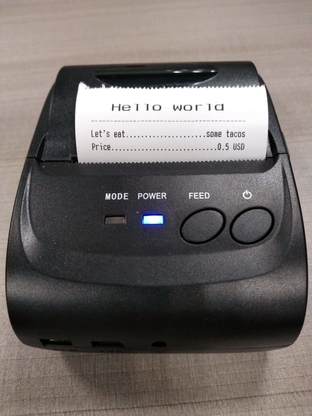

# ThermalPrinter
[](https://jitpack.io/#isradeleon/ThermalPrinter)
[](https://kotlinlang.org/)
[](https://developer.android.com/jetpack/androidx)

Android library for communication with thermal printers via Bluetooth.
This library is only compatible with [**androidx**](https://developer.android.com/jetpack/androidx/).

<p align="center">
    
</p>

## Installation

Add jitpack.io to your root build.gradle:
```gradle
allprojects {
    repositories {
        ...
        maven { url 'https://jitpack.io' }
    }
}
```

Finally add the dependency to your app build.gradle:
```gradle
dependencies {
    implementation "com.github.isradeleon:ThermalPrinter:$lastVersion"
}
```

## Usage
This library includes the code for the bluetooth connection. All you need to do is first to
start the ConnectBluetoothActivity:

```kotlin
override fun onCreate(savedInstanceState: Bundle?) {
    ...

    startActivityForResult(
        Intent(this, ConnectBluetoothActivity::class.java),
        ConnectBluetoothActivity.CONNECT_BLUETOOTH
    )
}
```

You'll get Activity.RESULT_OK if the device was successfully connected via bluetooth:

```kotlin
override fun onActivityResult(requestCode: Int, resultCode: Int, data: Intent?) {
    super.onActivityResult(requestCode, resultCode, data)

    if(resultCode == Activity.RESULT_OK && requestCode == ConnectBluetoothActivity.CONNECT_BLUETOOTH){
        // ThermalPrinter is ready
        ThermalPrinter.instance
            .write("Hello world", PrintAlignment.CENTER, PrintFont.LARGE)
            .fillLineWith('-')
            .write("Let's eat","some tacos")
            .write("Price","0.5 USD")
            .print()
    }
}
```

If you want to set or modify the BluetoothSocket by yourself, you can do it with the **BluetoothConnection** class.
ThermalPrinter uses this socket to send all its commands to the printer.

## ThermalPrinter methods

| Method | Description |
|------------------------------------|--------------------------|
| **print()** | Prints all the written content |
| **write(text: String)** | Writes text to thermal printer |
| **write(text: String, alignment: PrintAlignment)** | Writes text and sets the text alignment |
| **write(text: String, alignment: PrintAlignment, font: PrintFont)** | Writes text, sets text alignment and font size |
| **write(key: String, value: String)** | Writes a line with key value pair |
| **write(key: String, value: String, separator: Char)** | Writes a line with key value pair and fills space with separator |
| **newLine()** | Writes a new line to thermal printer |
| **fillLineWith(char: Char)** | Writes a line filled with the specified char |

## Result

<p align="center">
    
</p>

## License

This library is licensed under `MIT license`. View [license](LICENSE).